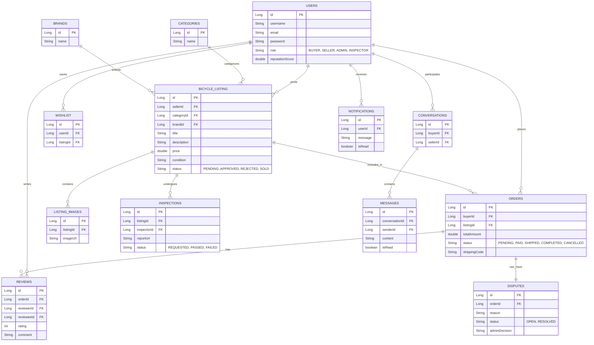
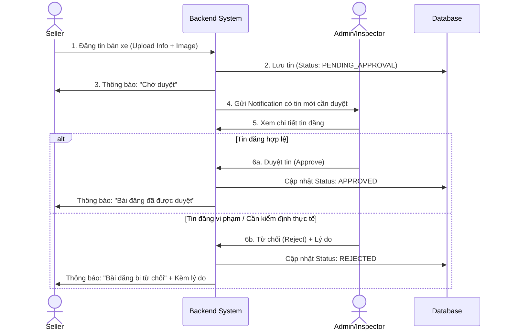
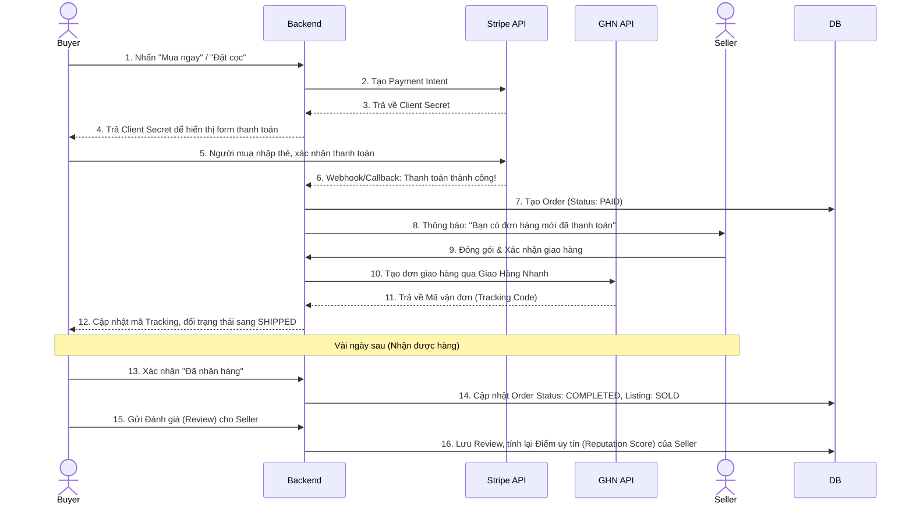
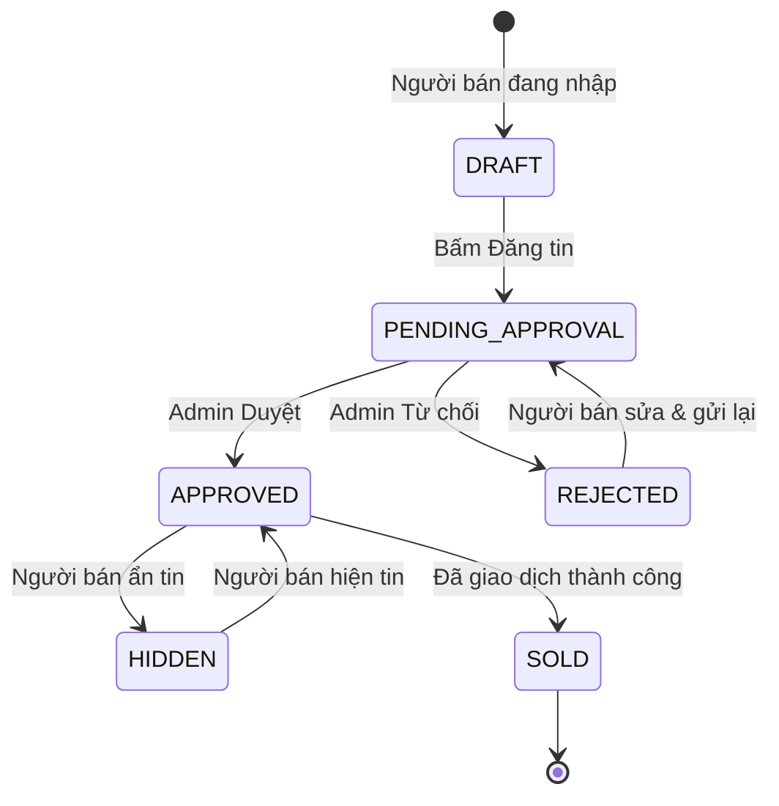
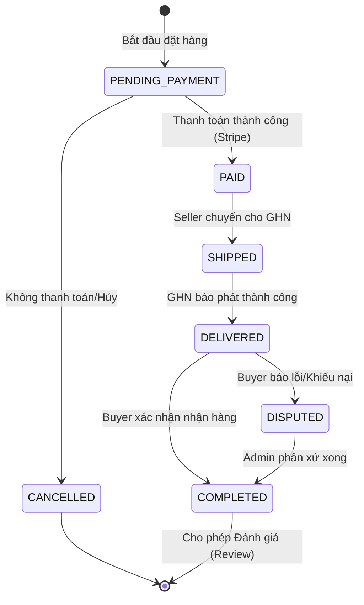

# 📐 TÀI LIỆU THIẾT KẾ & KIẾN TRÚC HỆ THỐNG
**Dự án: Website Kết Nối Mua Bán Xe Đạp Thể Thao Cũ**

---

## 1. Công nghệ & Công cụ sử dụng (Tech Stack)

Để đảm bảo hiệu năng, tính bảo mật và trải nghiệm người dùng, hệ thống sử dụng các công nghệ hiện đại sau:

### 🌟 Frontend (Web Client)
*   **Core:** ReactJS (hoặc Next.js) kết hợp với Vite để build siêu tốc.
*   **Ngôn ngữ:** JavaScript / TypeScript (Khuyến nghị dùng TypeScript để bắt lỗi Type).
*   **Styling & UI:** TailwindCSS (tùy chỉnh linh hoạt) kết hợp với các Material Design Components (MUI / Ant Design).
*   **State Management & Data Fetching:** React Query (quản lý state API) và Axios (gửi HTTP request).
*   **Routing:** React Router DOM (v6+).
*   **Biểu đồ (Admin):** Recharts.

### 🌟 Backend (REST API Server)
*   **Core:** Java 17+ và Spring Boot 3.x.
*   **Database Access:** Spring Data JPA + Hibernate (ORM).
*   **Bảo mật:** Spring Security + JSON Web Token (JWT) + BCrypt (Mã hóa mật khẩu).
*   **Validation:** Hibernate Validator.
*   **Tài liệu API:** Springdoc OpenAPI (Swagger UI).
*   **Build Tool:** Maven.

### 🌟 Database & Lưu trữ
*   **RDBMS:** PostgreSQL (Cụ thể là dùng Neon.tech cloud để team dễ dùng chung không cần cài local).
*   **Lưu trữ file/ảnh:** AWS S3, Cloudinary hoặc Firebase Storage.

### 🌟 Dịch vụ Báo bên thứ ba (Third-party Integrations)
*   **Thanh toán:** Stripe API (Test mode để mô phỏng luồng tiền thật).
*   **Vận chuyển:** GHN (Giao Hàng Nhanh) API (Test mode để tính phí và lấy mã vận đơn).
*   **Trí tuệ nhân tạo (AI):** Google Gemini Pro API (Xây dựng chatbot giải đáp tự động).

### 🌟 DevOps & Quản lý dự án
*   **Quản lý Task:** Jira Software (Mô hình Scrum 4 Sprints).
*   **Quản lý Source Code:** GitHub (Dùng chiến lược Member Branching hoặc Feature Branching).
*   **Môi trường chạy:** Docker (Đóng gói ứng dụng) / Vercel (Deploy FE) / Render hoặc Heroku (Deploy BE).

---

## 2. Yêu cầu Hệ thống (System Requirements)

### 2.1 Yêu cầu Chức năng (Functional Requirements)
**Đối với Khách hàng (Buyer):**
*   Tìm kiếm, lọc xe theo các tiêu chí (Hãng, Giá, Phân loại, Tình trạng, Kích cỡ khung).
*   Xem chi tiết sản phẩm, đánh giá và thông tin người bán.
*   Thêm vào danh sách yêu thích (Wishlist).
*   Hệ thống trò chuyện (Chat) trực tiếp với người bán.
*   Đặt hàng, thanh toán trực tuyến (tích hợp Stripe) hoặc đặt cọc.
*   Theo dõi trạng thái đơn hàng (tích hợp GHN Tracking).

**Đối với Người bán (Seller):**
*   Đăng tin bán xe (yêu cầu điền đầy đủ thông tin, upload ảnh thật).
*   Quản lý danh sách tin đăng (Sửa, ẩn, xóa).
*   Quản lý đơn đặt hàng từ khách hàng (Xác nhận, hủy).
*   Tương tác với khách hàng qua Chat.
*   Sử dụng Chatbot (Gemini) để tư vấn và viết mô tả tự động cho xe.

**Đối với Ban Quản trị (Admin / Inspector):**
*   Duyệt bài đăng mới của Seller (Bài đăng chỉ hiển thị công khai sau khi được Approve).
*   Quản lý User (Kích hoạt, khóa tài khoản vi phạm).
*   Quản lý danh mục xe và thương hiệu (Categories, Brands).
*   Tiếp nhận yêu cầu kiểm định, kiểm tra xe thực tế và cấp chứng nhận chất lượng (Inspector).
*   Giải quyết khiếu nại, tranh chấp giao dịch (Dispute).
*   Xem Dashboard thống kê (Doanh thu, số lượng xe, người dùng mới, biểu đồ tăng trưởng).

### 2.2 Yêu cầu Phi chức năng (Non-functional Requirements)
*   **Hiệu năng (Performance):** Tốc độ phản hồi API < 500ms. Hình ảnh upload cần được nén/tối ưu băng thông trước khi gửi lên Cloud. Hỗ trợ 1000+ người truy cập đồng thời vào giờ cao điểm.
*   **Bảo mật (Security):** Mật khẩu bắt buộc mã hóa Bcrypt. Mọi API tương tác dữ liệu phải xác thực token (JWT). Dữ liệu cá nhân (địa chỉ, số điện thoại) chỉ được tiết lộ giữa hai bên khi phát sinh đơn hàng. Bảo vệ dự án khỏi các lỗi SQL Injection, XSS.
*   **Độ tin cậy (Reliability):** Backend thiết kế theo nguyên lý bảo toàn giao dịch (ACID) đối với luồng Checkout và Payment. Hệ thống kỳ vọng Uptime tính sẵn sàng > 99%.
*   **Khả năng mở rộng (Scalability):** Tách bạch rõ giữa Backend API và Frontend React để triển khai độc lập. Dễ dàng nhân bản container backend hoặc sử dụng Load Balancer (khi chạy Docker).
*   **Tiêu chuẩn UX/UI:** Ứng dụng triển khai chuẩn thiết kế Mobile-first Design, hoạt động cực mượt mà trên Mobile/Tablet. Hỗ trợ giao diện sáng/tối (Light/Dark Mode).

---

## 3. Tổng quan Kiến trúc Hệ thống (High-Level Architecture)

Hệ thống được thiết kế theo kiến trúc Client-Server (Frontend - Backend tách biệt), giao tiếp thông qua RESTful API.

```mermaid
graph TD
    %% Frontend Clients
    subgraph Frontend [Frontend (React/Vite)]
        B[Buyer UI]
        S[Seller UI]
        A[Admin/Inspector Dashboard]
    end

    %% Backend Server
    subgraph Backend [Backend (Spring Boot)]
        API[REST API Controllers]
        Security[Spring Security + JWT]
        Services[Business Logic Services]
        Repo[JPA/Hibernate Data Access]
        
        API --> Security
        Security --> Services
        Services --> Repo
    end

    %% Database
    subgraph Database [Database]
        DB[(Neon PostgreSQL)]
    end

    %% External Services
    subgraph External [External Services / 3rd Party]
        Stripe[Stripe API - Thanh toán]
        GHN[GHN API - Giao hàng]
        Gemini[Google Gemini API - Chatbot]
    end

    %% Connections
    B <-->|HTTP/JSON| API
    S <-->|HTTP/JSON| API
    A <-->|HTTP/JSON| API
    
    Repo <-->|TCP/IP| DB
    
    Services -->|HTTP| Stripe
    Services -->|HTTP| GHN
    Services -->|HTTP| Gemini
```

---

## 4. Sơ đồ Thực thể Liên kết (ERD - Database Schema)

Dưới đây là sơ đồ mô tả cấu trúc Database cơ bản với khoảng 16 thực thể (Entities) chính của dự án.



---

## 5. Các Luồng Nghiệp Vụ Cốt Lõi (Sequence Diagrams)

### 5.1. Luồng Đăng tin & Kiểm duyệt (Post & Approve Listing)
Đảm bảo chất lượng tin đăng trước khi hiển thị cho người mua.



### 5.2. Luồng Mua Bán & Thanh Toán (Order & Payment)
Quá trình từ lúc người mua đặt cọc đến khi kết thúc giao dịch và đánh giá.



---

## 6. Quản Lý Trạng Thái (State Machines)

### 6.1. Vòng đời của Tin đăng (Bicycle Listing State)


### 6.2. Vòng đời của Đơn hàng (Order State)


---

## 7. Tổ chức Thư mục (Project Structure)

### 7.1 Backend (Spring Boot)
```text
BACKEND/
├── src/main/java/com/bicycle/selling/
│   ├── config/            # Cấu hình Security, CORS, Swagger, JWT
│   ├── controller/        # Xử lý Request/Response (REST APIs)
│   ├── dto/               # Data Transfer Objects (Request/Response payload)
│   ├── exception/         # Xử lý lỗi tập trung (Global Exception Handler)
│   ├── model/             # JPA Entities (User, BicycleListing...)
│   │   └── enums/         # Enum cho Status, Role...
│   ├── repository/        # Spring Data JPA Interfaces
│   ├── service/           # Logic nghiệp vụ chính
│   │   ├── impl/          # Implement của logic
│   │   └── thirdparty/    # Logic tích hợp Stripe, GHN, Gemini
│   ├── security/          # JWT Filters, UserDetails
│   └── SellingApplication.java
└── src/main/resources/
     ├── application.properties  # Cấu hình kết nối DB, API Keys
     └── data.sql                # Script seed dữ liệu giả
```

### 7.2 Frontend (React / Vite)
```text
FRONTEND/
├── src/
│   ├── assets/            # CSS, Hình ảnh tĩnh
│   ├── components/        # Các thành phần tái sử dụng (Button, Table, Card...)
│   ├── layouts/           # Header, Footer, AdminSidebar
│   ├── pages/             # Các màn hình chính (Home, Login, AdminDashboard)
│   ├── services/          # Các hàm Axios gọi REST API Backend
│   ├── hooks/             # Custom React Hooks
│   ├── context/           # React Context (AuthContext, CartContext)
│   ├── utils/             # Các hàm tiện ích (Format tiền, Format ngày...)
│   ├── App.jsx            # Cấu hình React Router Go
│   └── main.jsx           # Entry point
├── package.json
└── vite.config.js
```
